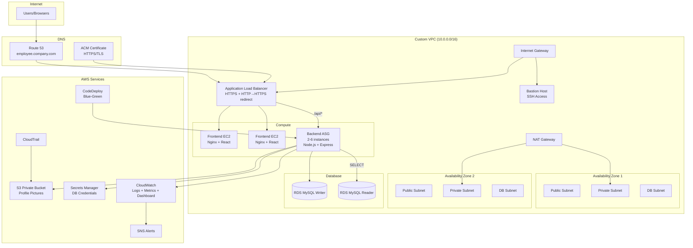

# Employee Management System

A production-ready, full-stack Employee Management System deployed entirely on AWS, following the AWS Well-Architected Framework.

## Architecture



## Tech Stack

| Layer | Technology |
|-------|-----------|
| Frontend | React 18, TypeScript, Vite, Chart.js |
| Backend | Node.js 20, Express, TypeScript |
| Database | Amazon RDS MySQL 8.0 (Writer + Reader) |
| Auth | JWT + bcrypt |
| IaC | Terraform |
| CI/CD | GitHub Actions + CodeDeploy (Blue-Green) |
| Containers | Docker + docker-compose (local dev) |

## Project Structure

```
aws-fullstack-employee-system/
├── backend/                 # Node.js REST API
│   ├── src/
│   │   ├── config/          # Database, AWS, app config
│   │   ├── controllers/     # MVC controllers
│   │   ├── middleware/      # Auth, audit, validation
│   │   ├── repositories/    # Data access layer
│   │   ├── routes/          # API route definitions
│   │   ├── services/        # Business logic (S3, auth)
│   │   ├── types/           # TypeScript interfaces
│   │   ├── utils/           # Logger, errors, helpers
│   │   └── validators/      # Input validation rules
│   ├── database/            # SQL schema + seed data
│   └── scripts/             # CodeDeploy lifecycle hooks
├── frontend/                # React SPA
│   ├── src/
│   │   ├── components/      # Layout, ProtectedRoute
│   │   ├── context/         # Auth + Theme providers
│   │   ├── pages/           # Dashboard, Employees, etc.
│   │   ├── services/        # API client
│   │   └── styles/          # Global CSS + dark mode
│   └── nginx.conf           # Production Nginx config
├── terraform/               # AWS infrastructure
│   └── modules/
│       ├── vpc/             # VPC, subnets, NAT, NACLs
│       ├── security-groups/
│       ├── iam/             # 3 IAM roles
│       ├── rds/             # MySQL writer + reader
│       ├── alb/             # ALB + target groups
│       ├── asg/             # Auto Scaling Group
│       ├── s3/              # Profile pictures + CloudTrail
│       ├── codedeploy/      # Blue-green deployment
│       └── monitoring/      # CloudWatch + SNS
├── .github/workflows/       # CI/CD pipeline
├── docs/                    # Deployment guide, API docs
└── docker-compose.yml       # Local development
```

## Quick Start (Local Development)

### Prerequisites

- Docker & Docker Compose
- Node.js 20+ (optional, for running outside Docker)

### Steps

```bash
# 1. Clone the repository
git clone <repo-url>
cd aws-fullstack-employee-system

# 2. Start all services
docker-compose up -d

# 3. Wait for MySQL to initialize (~30 seconds)
docker-compose logs -f mysql

# 4. Access the application
# Frontend: http://localhost:3000
# Backend API: http://localhost:3001/api/v1
# Swagger Docs: http://localhost:3001/api/docs
```

### Demo Credentials

| Email | Password | Role |
|-------|----------|------|
| admin@company.com | Password123! | admin |
| hr@company.com | Password123! | hr |
| manager@company.com | Password123! | manager |
| john.doe@company.com | Password123! | employee |

## API Endpoints

| Method | Endpoint | Description | Roles |
|--------|----------|-------------|-------|
| GET | `/api/v1/health` | Health check | Public |
| POST | `/api/v1/auth/login` | Login | Public |
| GET | `/api/v1/auth/me` | Current user | All |
| GET | `/api/v1/dashboard/stats` | Dashboard data | All |
| GET/POST/PUT/DELETE | `/api/v1/employees` | Employee CRUD | admin, hr |
| GET/POST/PUT/DELETE | `/api/v1/departments` | Departments | admin, hr |
| GET/POST/PUT | `/api/v1/attendance` | Attendance | admin, hr, manager |
| GET/POST/PATCH | `/api/v1/leave` | Leave management | All |
| GET/POST/PUT | `/api/v1/payroll` | Payroll | admin, hr |
| GET | `/api/v1/audit-logs` | Audit trail | admin |

Full API documentation available at `/api/docs` (Swagger UI).

## AWS Deployment

See [docs/DEPLOYMENT.md](docs/DEPLOYMENT.md) for the complete deployment guide.

### Quick Overview

1. Configure `terraform/terraform.tfvars`
2. Run `terraform init && terraform apply`
3. Configure GitHub Actions secrets
4. Push to `main` branch to trigger CI/CD

## Security Features

- **IAM Roles only** — no access keys in application code
- **Private RDS** — database in isolated subnets
- **Secrets Manager** — database credentials rotation
- **HTTPS everywhere** — ACM certificate + ALB TLS termination
- **Security Groups + NACLs** — defense in depth
- **Input validation** — express-validator on all endpoints
- **SQL injection prevention** — parameterized queries via mysql2
- **XSS protection** — Helmet security headers
- **Rate limiting** — express-rate-limit
- **Password hashing** — bcrypt with cost factor 12
- **CloudTrail** — API audit logging

## IAM Roles

| Role | Purpose | Permissions |
|------|---------|-------------|
| EC2 Backend Role | Application runtime | S3 R/W, Secrets Manager read, CloudWatch Logs/Metrics |
| Deployment Role | CodeDeploy | CodeDeploy, S3, EC2, Auto Scaling |
| Monitoring Role | Alerting | CloudWatch, SNS publish |

## Monitoring

- **CloudWatch Logs** — application logs from backend instances
- **CloudWatch Metrics** — ALB, RDS, ASG metrics
- **CloudWatch Dashboard** — unified operational view
- **SNS Alerts** — email notifications for alarms
- **CloudTrail** — AWS API audit trail

## License

MIT
