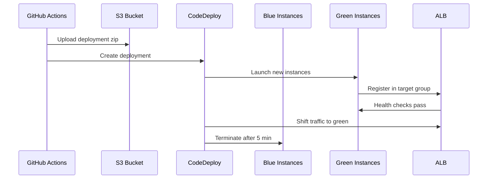

# Deployment Guide

Step-by-step guide to deploy the Employee Management System on AWS.

## Prerequisites

- AWS account with admin access
- AWS CLI v2 configured
- Terraform >= 1.5.0
- Domain name with Route 53 hosted zone
- EC2 key pair for bastion SSH access
- GitHub repository with Actions enabled

## Step 1: Configure Terraform Variables

```bash
cd terraform
cp terraform.tfvars.example terraform.tfvars
```

Edit `terraform.tfvars`:

```hcl
aws_region       = "us-east-1"
domain_name       = "employee.yourcompany.com"
route53_zone_name = "yourcompany.com"    # Terraform looks up the hosted zone ID automatically
# hosted_zone_id  = "Z0XXXXXXXXXX"       # Optional: use instead of route53_zone_name
bastion_key_name = "your-ec2-key-pair"
alert_email      = "ops@yourcompany.com"
db_username      = "ems_admin"
db_password      = "<strong-random-password>"
```

## Step 2: Provision Infrastructure

```bash
terraform init
terraform plan -out=tfplan
terraform apply tfplan
```

This creates (~30 minutes):
- VPC with 2 AZs, public/private/DB subnets
- Internet Gateway + NAT Gateway
- Security Groups + Network ACLs
- RDS MySQL (writer + read replica)
- ALB with HTTPS listener + HTTP redirect
- ACM certificate (DNS validated)
- Route 53 alias record
- EC2 ASG (2-6 backend instances)
- Frontend EC2 instances with Nginx
- Bastion host
- S3 buckets (profiles + CloudTrail)
- Secrets Manager secret
- IAM roles (3)
- CodeDeploy app + deployment group
- CloudWatch dashboard + SNS alerts
- CloudTrail

Save the outputs:

```bash
terraform output -json > ../outputs.json
```

## Step 3: Initialize Database

SSH to bastion, then connect to RDS:

```bash
# SSH to bastion
ssh -i your-key.pem ec2-user@<bastion-ip>

# Install MySQL client
sudo dnf install -y mariadb105

# Get RDS endpoint from Secrets Manager
aws secretsmanager get-secret-value \
  --secret-id ems/rds/credentials \
  --query SecretString --output text | jq .

# Connect and run schema
mysql -h <writer-endpoint> -u ems_admin -p < init.sql
mysql -h <writer-endpoint> -u ems_admin -p < seed.sql
```

Upload SQL files first:

```bash
scp -i your-key.pem backend/database/*.sql ec2-user@<bastion-ip>:~/
```

## Step 4: Configure GitHub Actions Secrets

In your GitHub repository → **Settings** → **Secrets and variables** → **Actions** → **New repository secret**:

| Secret | How to get the value |
|--------|----------------------|
| `AWS_ACCESS_KEY_ID` | IAM user access key for CI/CD |
| `AWS_SECRET_ACCESS_KEY` | IAM user secret key |
| `DEPLOY_BUCKET` | `terraform output -raw deploy_bucket_name` |
| `CODEDEPLOY_APP_NAME` | `terraform output -raw codedeploy_app_name` |
| `CODEDEPLOY_DG_NAME` | `terraform output -raw codedeploy_deployment_group_name` |

Get all values at once:

```bash
cd terraform
terraform output -raw deploy_bucket_name
terraform output -raw codedeploy_app_name
terraform output -raw codedeploy_deployment_group_name
```

> **Note:** Create a dedicated IAM user for CI/CD with least-privilege permissions for S3, CodeDeploy, EC2, and SSM. Do not use root credentials.
>
> If you see `s3:///frontend/...` in CI logs, `DEPLOY_BUCKET` is missing or empty in GitHub Secrets.

## Step 5: Deploy Application

Push to `main` branch:

```bash
git push origin main
```

GitHub Actions will:
1. Run lint and build for backend + frontend
2. Validate Terraform configuration
3. Package backend and deploy via CodeDeploy (blue-green)
4. Build frontend and deploy to EC2 instances

## Step 6: Verify Deployment

```bash
# Health check
curl https://employee.yourcompany.com/api/v1/health

# Login test
curl -X POST https://employee.yourcompany.com/api/v1/auth/login \
  -H "Content-Type: application/json" \
  -d '{"email":"admin@company.com","password":"Password123!"}'

# Open frontend
open https://employee.yourcompany.com
```

## Step 7: Confirm SNS Subscription

Check your email for the SNS subscription confirmation and click **Confirm subscription**.

## Blue-Green Deployment Flow



## Rollback

If a deployment fails, CodeDeploy auto-rolls back. Manual rollback:

```bash
aws deploy stop-deployment --deployment-id <id> --auto-rollback-enabled
```

## Troubleshooting

### Backend health check failing
```bash
# SSH via bastion to a backend instance
ssh -i key.pem -J ec2-user@<bastion-ip> ec2-user@<private-ip>
sudo journalctl -u ems-backend -f
```

### RDS connection issues
- Verify security group allows port 3306 from backend SG
- Check Secrets Manager has correct endpoints
- Confirm backend IAM role has `secretsmanager:GetSecretValue`

### ALB 502 errors
- Check target group health in EC2 console
- Verify backend listens on port 3001
- Check `/api/v1/health` returns 200

## Cost Optimization Tips

- Use Reserved Instances for RDS in production
- Set ASG max to actual peak load needs
- Enable S3 lifecycle policies for CloudTrail logs
- Use `t3.small` for non-production environments

## Destroy Infrastructure

```bash
cd terraform
terraform destroy
```

> **Warning:** This deletes all resources including RDS data. Ensure backups exist before destroying.
